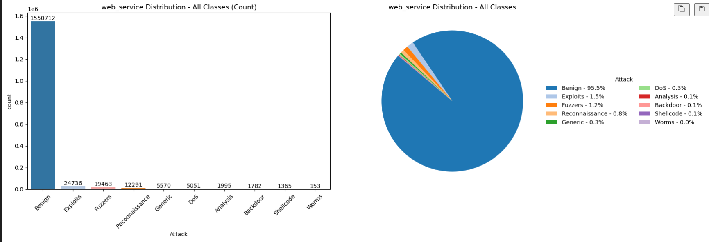

# **NetGuard: A Machine Learning Framework for Network Intrusion Detection**

## **Introduction**

NetGuard is a machine learning project that applies and evaluates different classifiers to detect malicious network traffic from flow-level statistics. The project tackles two primary classification tasks:

1.  **Binary Classification**: Distinguishing between *Benign* (normal) and *Attack* (malicious) traffic.
2.  **Multi-Class Classification**: Identifying the specific *type* of attack (e.g., DoS, Exploits, Reconnaissance).

The project follows a comprehensive workflow:

  * **Data Loading and EDA**: Loading the `netflow.csv` dataset and performing exploratory data analysis to understand feature distributions and class imbalance.
  * **Preprocessing and Balancing**: Converting IP addresses to numerical format and, crucially, balancing the highly imbalanced dataset using oversampling.
  * **Model Training**: Implementing and training three distinct ML models (KNN, Random Forest, XGBoost).
  * **Model Evaluation**: Evaluating all models on both the binary and multi-class tasks using metrics like accuracy, precision, recall, and F1-score.
  * **Results Analysis**: Comparing model performance to determine the most effective approach for intrusion detection.

#### `Target 'Attack' Class Distribution`

  

## **Problem Statement**

The core goal is to build and evaluate models that can accurately identify network intrusions from statistical flow-level data. This project addresses several key questions:

  * Can we effectively distinguish between **benign** and **malicious network flows** based on features like byte counts, packet counts, and flow duration?
  * Which **machine learning models** (e.g., K-Nearest Neighbors, Random Forest, XGBoost) perform best for both **binary malware detection** and **multi-class attack classification**?
  * What is the impact of **feature importance** on predicting whether a flow is benign or malicious?
  * What challenges arise from a **highly imbalanced dataset** where some attack categories are extremely rare?

### Dataset

The dataset (`netflow.csv`) is a large-scale collection of network flow records, containing over **216 million entries** and 14 features, including:

  * `IPV4_SRC_ADDR` / `IPV4_DST_ADDR`
  * `L4_SRC_PORT` / `L4_DST_PORT`
  * `PROTOCOL` / `L7_PROTO`
  * `IN_BYTES` / `OUT_BYTES`
  * `IN_PKTS` / `OUT_PKTS`
  * `TCP_FLAGS`
  * `FLOW_DURATION_MILLISECONDS`

## **Solution and Approach**

To tackle the classification problem, several key steps were taken before modeling:

1.  **Feature Engineering**: IP addresses (`IPV4_SRC_ADDR`, `IPV4_DST_ADDR`) were converted from string format to integers to be used as numerical features.
2.  **Data Balancing**: The dataset was found to be severely imbalanced. Minority attack classes (e.g., 'Worms', 'Backdoor') were **oversampled** to ensure each class made up at least 6% of the training data, allowing the models to learn their patterns.
3.  **Train-Test Split**: A custom split was performed to create training and test sets that maintained the complex class distributions.
4.  **Model Implementation**: Three distinct classifiers were trained and compared:
      * **Random Forest (Bagging Classifier)**: An ensemble of decision trees known for its robustness and ability to handle complex interactions.
      * **XGBoost (Boosting Classifier)**: A gradient-boosted ensemble that iteratively corrects errors from previous models.
      * **K-Nearest Neighbors (KNN)**: An instance-based learner that classifies new data based on its "neighbors" in the feature space.

## **Results**

The models were evaluated on both the complex 10-class problem and the simpler binary (malware vs. benign) problem.

### **Multi-Class Classification Results**

This task involved identifying the specific type of traffic (e.g., 'Benign', 'DoS', 'Exploits').

| Model | Accuracy | Precision (weighted) | Recall (weighted) | F1-score (weighted) |
|---|---|---|---|---|
| **Random Forest** | 0.909 | 0.937 | 0.909 | 0.917 |
| **KNN** | 0.904 | 0.919 | 0.904 | 0.909 |
| **XGBoost** | 0.886 | 0.920 | 0.886 | 0.895 |

#### `Visual representation`

  
  

### **Binary Classification Results (Benign vs. Attack)**

This task simplified the problem to a binary "normal" (0) or "malicious" (1) label.

| Model | Accuracy | F1-score |
|---|---|---|
| **Random Forest** | 0.996 | 0.996 |
| **KNN** | 0.992 | 0.991 |
| **XGBoost** | 0.989 | 0.988 |

#### `Visual representation`

  
  

### **Analysis**

  * **Random Forest** emerged as the **top-performing model** in all scenarios. It achieved the highest accuracy and F1-score for both the complex multi-class problem and the simpler binary task, demonstrating its robustness and effectiveness.
  * All models achieved **exceptionally high performance (98-99%+)** on the **binary** task. This confirms that the flow-level features are highly effective at separating malicious traffic from benign traffic.
  * The **multi-class** task proved more challenging due to the overlap between different attack types and the severe class imbalance (which was mitigated by oversampling).
  * **KNN** performed surprisingly well, nearly matching Random Forest in the multi-class setting, indicating that many attack classes form distinct clusters in the feature space.

## **Technologies Used**

  * **Data Manipulation**: `pandas`, `numpy`
  * **Data Visualization**: `matplotlib`, `seaborn`, `plotly`
  * **ML Modeling**: `scikit-learn` (`RandomForestClassifier`, `KNeighborsClassifier`, `LabelEncoder`, `metrics`), `xgboost` (`XGBClassifier`)
  * **Utilities**: `joblib` (for saving models), `ipaddress`, `json`
