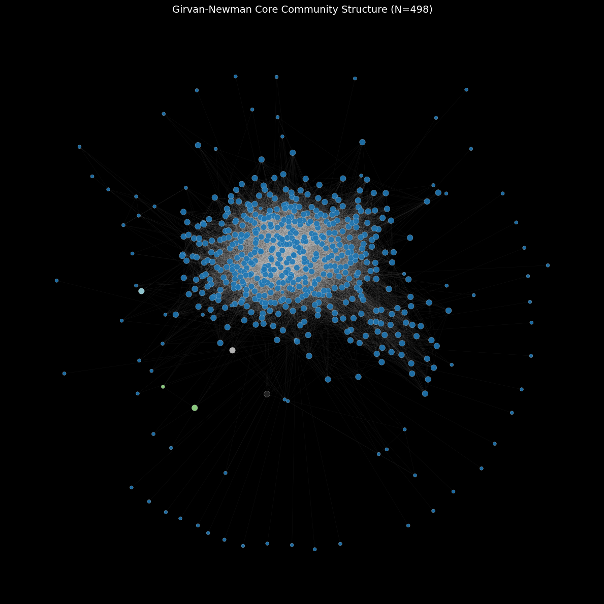
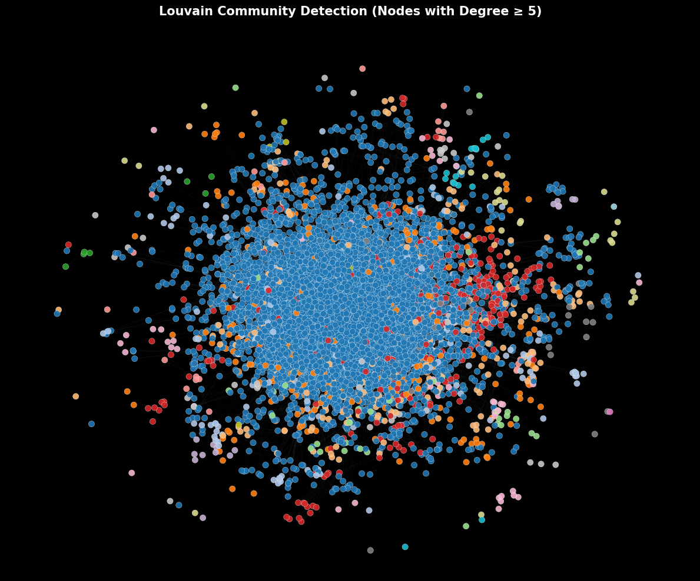
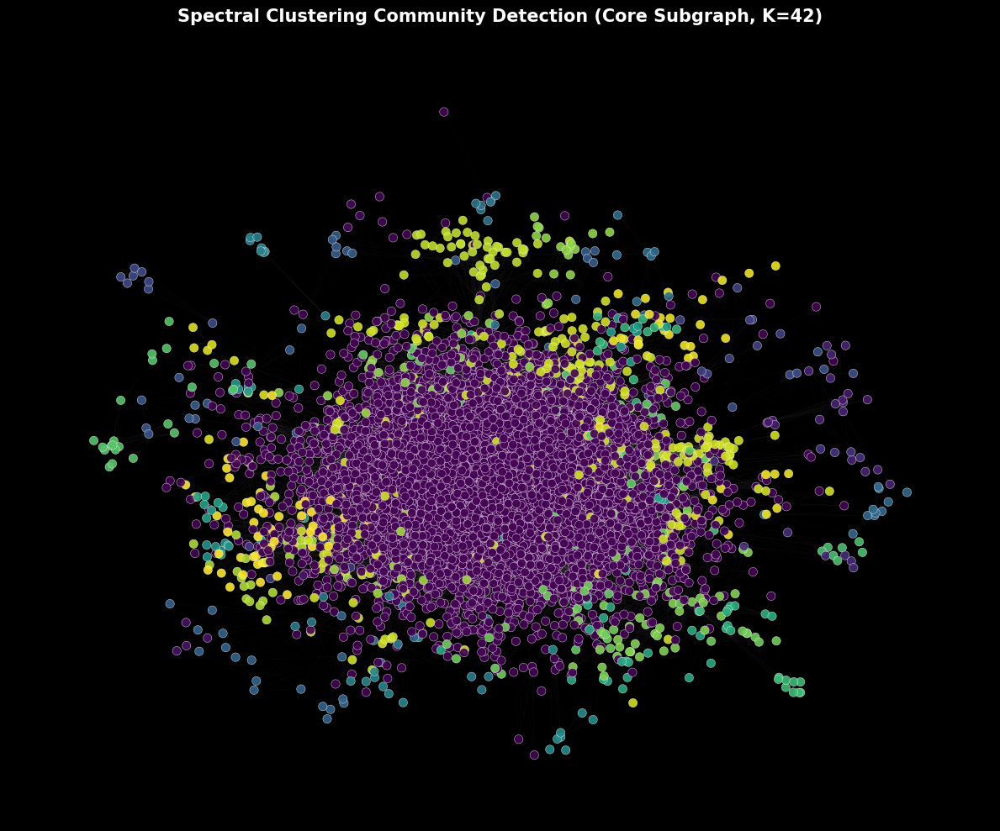
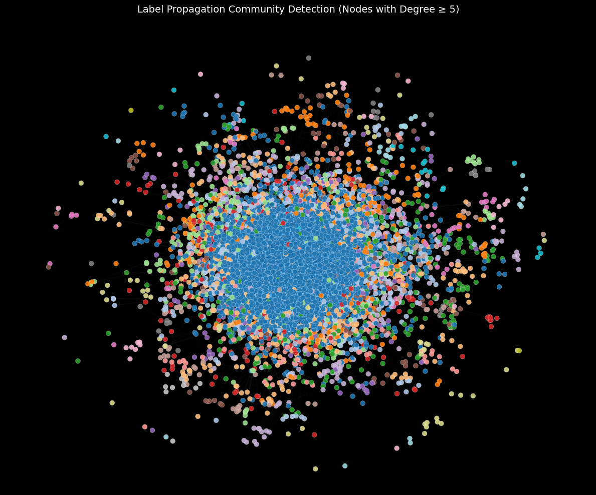

# **GraphMinds: Algorithmic Exploration of Network Communities**

## **Introduction**

GraphMinds is a graph analytics project that applies and compares multiple community detection algorithms on a large-scale real-world communication network — the **Enron Email Network**.

The project focuses on identifying hidden structural communities within organizational communication patterns using graph-theoretic approaches.

The project follows a comprehensive workflow:

* **Graph Construction**: Loading the Enron email dataset and building an undirected communication graph.
* **Core Subgraph Extraction**: Constructing a high-degree core subgraph (when required) for computational feasibility.
* **Algorithm Implementation**: Applying five distinct community detection techniques.
* **Performance Evaluation**: Comparing algorithms based on scalability, interpretability, and structural clarity.
* **Visualization**: Generating graph visualizations for the main network and each detected community structure.

#### `Main Enron Communication Graph`

  

## **Problem Statement**

The core objective is to uncover hidden communities within a large-scale email communication network and evaluate how different graph algorithms interpret structural divisions.

This project addresses several key questions:

* Can we identify **organizational subgroups** purely from communication patterns?
* How do different **community detection algorithms** compare in terms of scalability and quality of clusters?
* Which methods capture **hierarchical structures** versus flat partitions?
* What trade-offs exist between **accuracy and computational complexity** in large graph analysis?

### Dataset

The dataset used is the **Enron Email Network** from the Stanford SNAP repository.

* **Nodes**: 36,692 (email addresses)
* **Edges**: 183,831 (email communications)
* **Graph Type**: Undirected
* **Format**: Text file with two columns — `FromNodeId`, `ToNodeId`

This dataset represents real-world corporate communication, making it ideal for studying structural and organizational patterns through graph analytics.

## **Solution and Approach**

To analyze the communication network, the following steps were performed:

1. **Graph Creation**
   The dataset was parsed to construct an undirected graph using adjacency relationships between email addresses.

2. **Core Subgraph Construction (Optional Step)**
   Since some algorithms are computationally expensive, a subgraph of top-degree nodes was extracted for scalability.

3. **Community Detection Algorithms Implemented**

   * **Girvan–Newman Algorithm**
     Edge-betweenness based modularity optimization.

   * **Louvain Method**
     Hierarchical modularity optimization for large networks.

   * **Spectral Clustering**
     Community detection using Laplacian eigenvectors.

   * **Label Propagation**
     Fast heuristic method based on iterative label updates.

   * **Hierarchical Clustering**
     Agglomerative clustering based on structural similarity.

4. **Visualization & Interpretation**
   Each algorithm’s detected communities were visualized and compared for interpretability.

## **Results**

Each algorithm revealed distinct structural properties of the network.

### **Community Detection Comparison**

| Algorithm             | Scalability | Structure Type                 | Speed    |
| --------------------- | ----------- | ------------------------------ | -------- |
| **Girvan–Newman**     | Low         | Few large clusters             | Slowest  |
| **Louvain**           | High        | Well-balanced modular clusters | Fast     |
| **Spectral**          | Moderate    | Clear global partitions        | Moderate |
| **Label Propagation** | Very High   | Local dense clusters           | Fastest  |
| **Hierarchical**      | Low         | Nested multi-level clusters    | Slow     |

### **1️. Girvan–Newman Communities**

  

* Produces clear modular boundaries.
* Computationally expensive for large graphs.
* Best suited for small subgraphs.

### **2️. Louvain Communities**

  

* Best overall balance between scalability and modularity.
* Captures well-separated and meaningful clusters.
* Efficient for large-scale networks.

### **3️. Spectral Clustering Communities**

  

* Reveals high-level structural partitions.
* Good for identifying major divisions in the network.
* Sensitive to graph sparsity.

### **4️. Label Propagation Communities**

  

* Extremely fast and scalable.
* Captures local dense clusters effectively.
* Results may vary due to random initialization.

### **5️. Hierarchical Clustering Communities**

  

* Provides interpretable nested community structures.
* Useful for analyzing multi-level organizational relationships.
* Computationally expensive on full-scale graphs.

## **Analysis**

* **Louvain Method** emerged as the most effective approach, offering the best trade-off between scalability and modularity quality.
* **Girvan–Newman** was structurally accurate but impractical for large networks.
* **Spectral Clustering** successfully identified high-level organizational splits.
* **Label Propagation** was ideal for fast exploration but lacked stability.
* **Hierarchical Clustering** revealed nested structures, providing deeper insight into team-level interactions.

The comparison demonstrates that no single algorithm is universally superior — the choice depends on dataset size, computational resources, and interpretability requirements.

## **Technologies Used**

* **Graph Processing**: `networkx`
* **Scientific Computing**: `numpy`, `scipy`
* **Clustering & ML Utilities**: `scikit-learn`
* **Visualization**: `matplotlib`
* **Data Handling**: `pandas`