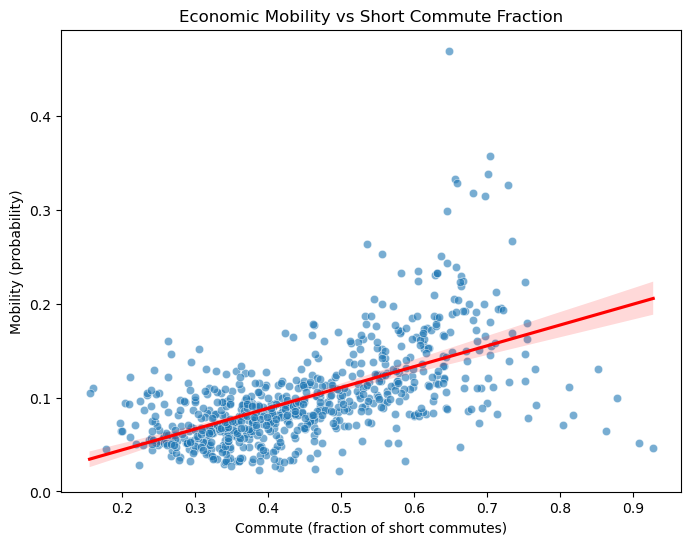
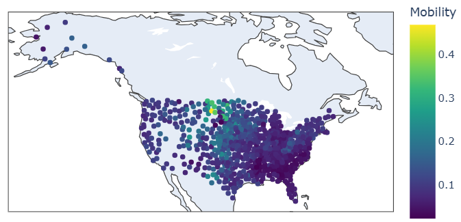
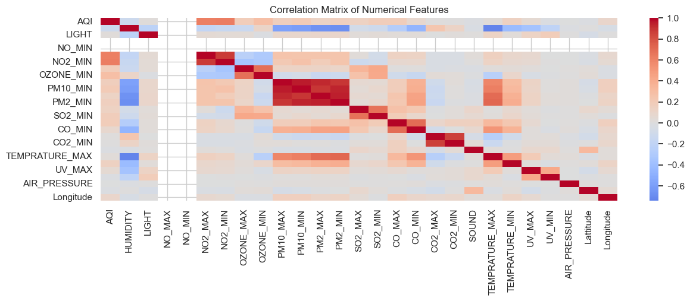
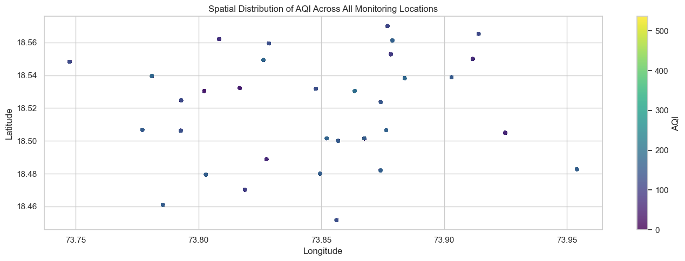
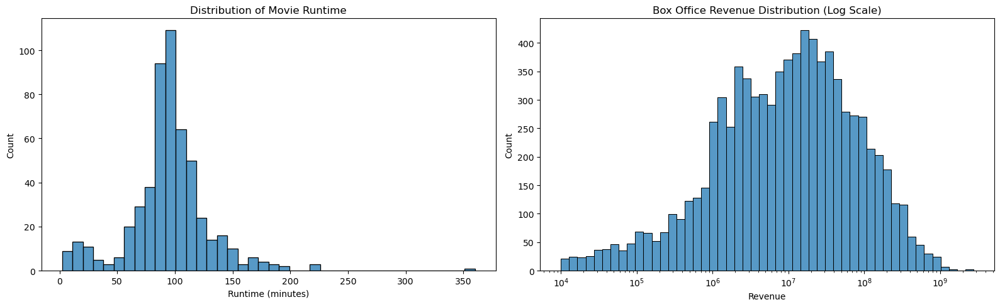
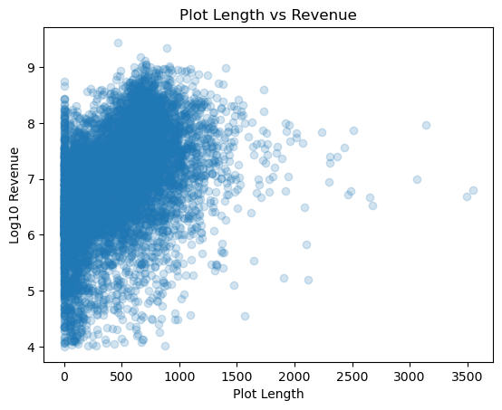

## **Project 05. Final Exam — Applied Data Science Case Studies**

This project consists of three independent real-world analytics problems spanning economic research, environmental forecasting, and predictive modeling. Each problem integrates exploratory data analysis, statistical modeling, validation, and domain-level interpretation to derive actionable insights from structured and unstructured datasets.

* Problem 01. **Mobility Matters — The Commute & Opportunity Link**
* Problem 02. **AirSense — Intelligent AQI Forecasting System**
* Problem 03. **BoxOfficeAI — Decoding Movie Revenue Drivers**

---

# Problem 01. **Mobility Matters — The Commute & Opportunity Link**

## Problem Statement

Does better transportation access, measured through shorter commute times, correlate with higher economic mobility across U.S. communities?

The goal is to evaluate whether infrastructure accessibility may be structurally associated with upward income mobility.

## Dataset

* 729 U.S. communities
* Economic mobility: probability of rising from bottom to top income quintile
* Fraction of workers commuting <15 minutes
* Geographic variables: latitude, longitude
* State identifiers (used for fixed effects)

The dataset captures regional heterogeneity, allowing evaluation of both direct and controlled relationships.

## Solution & Approach

* Exploratory Data Analysis:

  * Distribution analysis of mobility and commute variables
  * Correlation matrix inspection
  * Spatial visualization across U.S. geography
* Simple Linear Regression:

  * Mobility ~ Commute
* Multiple Regression:

  * Mobility ~ Commute + Latitude + Longitude + State Fixed Effects
* Diagnostics:

  * Residual normality tests
  * Multicollinearity inspection
  * Durbin–Watson for autocorrelation

The modeling strategy isolates the marginal contribution of commute access while controlling for geographic clustering.

## Results

* Strong positive association between short commutes and mobility
* Simple model: **R² ≈ 0.35**
* Controlled model: **R² ≈ 0.60**
* Commute coefficient remains statistically significant (p < 0.001)
* Effect size remains economically meaningful after geographic adjustment

## Analysis

The regression relationship is visually evident:

The upward slope confirms a consistent positive association between commute accessibility and economic mobility.

Geographic clustering further contextualizes the pattern:

Higher mobility clusters appear concentrated in certain Midwest and Mountain regions, indicating that geography partially explains variation — but does not eliminate the commute effect.

Even after controlling for state-level fixed effects, commute accessibility remains a strong predictor of upward mobility. While the study is observational and cannot establish causality, the relationship is stable, statistically robust, and policy-relevant.

---

# Problem 02. **AirSense — Intelligent AQI Forecasting System**

## Problem Statement

Can we accurately predict Air Quality Index (AQI), AQI category, and dominant pollutant using pollutant concentrations, environmental variables, and spatial information?

The objective is not only prediction accuracy but also interpretability and scalability across regions.

## Dataset

* Pune air monitoring dataset
* Pollutants: PM2.5, PM10, NO₂, Ozone, CO, SO₂
* Environmental variables: humidity, temperature, UV index, air pressure
* Spatial features: latitude, longitude
* Approximately 370,000 missing values addressed via structured imputation

The dataset exhibits category imbalance and station-level bias, requiring careful preprocessing.

## Solution & Approach

* Bias analysis:

  * Station-level observation imbalance
  * Temporal imbalance across hours
  * AQI category skew
* Correlation analysis to detect multicollinearity
* KNN-based imputation (k=7, distance-weighted)
* Standardization and encoding
* Random Forest models for:

  * AQI regression
  * AQI category classification
  * Dominant pollutant classification
* Residual diagnostics and validation

Random Forest was selected due to robustness to nonlinear relationships and multicollinearity among pollutants.

## Results

* AQI Regression: **RMSE ≈ 3.44**
* AQI Category Classification: **~99% accuracy**
* Dominant Pollutant Classification: **~99% accuracy**
* PM2.5 and PM10 identified as dominant predictors
* Model pipeline generalizable across cities

## Analysis

Feature interdependencies are evident:

High correlations between pollutant minima/maxima confirm multicollinearity, reinforcing the choice of tree-based models.

Spatial structure further validates the need for geographic features:

Clusters of elevated AQI values highlight localized pollution patterns, indicating that spatial effects influence predictions.

Particulate matter dominates AQI behavior, while traffic-related pollutants exhibit diurnal variation. The modeling framework supports real-time deployment and can trigger automated policy responses such as traffic control measures or health advisories.

---

# Problem 03. **BoxOfficeAI — Decoding Movie Revenue Drivers**

## Problem Statement

Can movie revenue be predicted using structured metadata (genre, runtime, actors) and unstructured narrative features extracted from plot summaries?

The objective is to quantify the predictive value of storytelling and structural characteristics.

## Dataset

* MovieSummaries dataset
* Movie-level metadata: genre, runtime, release year, revenue
* Character-level metadata: actor information
* Plot summaries (text corpus)

Revenue is log-transformed due to heavy right skew.

## Solution & Approach

* Exploratory Data Analysis:

  * Runtime and revenue distributions
  * Genre frequency analysis
  * Actor frequency and revenue association
* Text processing:

  * TF-IDF vectorization of plot summaries
* Three modeling strategies:

  * Metadata-only Random Forest
  * Plot-only Ridge Regression
  * Combined Metadata + Text Model (ColumnTransformer)

The combined approach evaluates complementarity between narrative and structural features.

## Results

* Metadata model: **R² ≈ 0.30**
* Plot-only model: **R² ≈ 0.20**
* Combined model: **R² ≈ 0.35 (best performance)**
* Genre strongest structural predictor
* Actor variables add limited marginal signal

## Analysis

Runtime and revenue distribution illustrate skew and variance:

The runtime–revenue relationship confirms high dispersion:

Revenue is moderately predictable, but large unexplained variance remains, likely driven by external factors such as budget, franchise strength, and marketing scale.

Genre provides the strongest signal among structured features, while plot-based features capture thematic influence. Actor presence contributes less predictive power than expected, suggesting that storytelling structure outweighs individual star effects in this dataset.