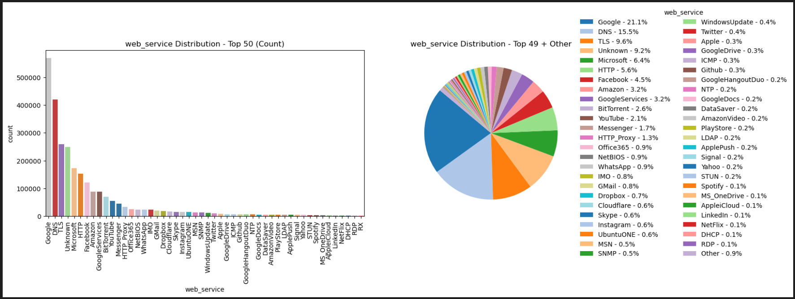
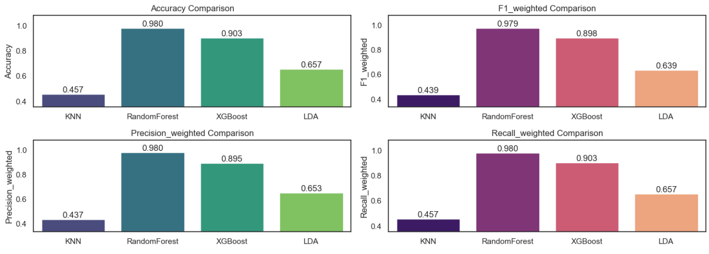
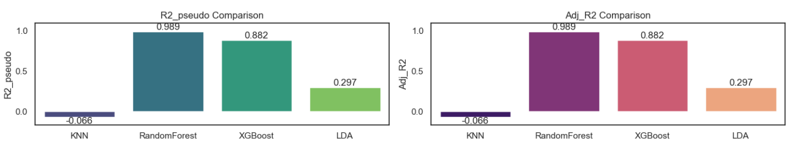

# **TrafficNet: A Machine Learning Approach to Network Traffic Classification**

## **Introduction**

TrafficNet applies machine learning (ML) models to classify different types of network services such as streaming, web browsing, and file transfers from a dataset of network flows. Accurate traffic classification is crucial for network management, security, and quality-of-service optimization.

The project follows a standard ML workflow:

- **Data Loading and Exploration**: Load and inspect the dataset (`Unicauca-dataset-April-June-2019-Network-flows.csv`), which contains 2.7M+ rows and 50 features.
- **Feature Engineering and Selection**: Analyze features (e.g., duration, packet counts, inter-arrival times) for relevance to the target variable (`web_service`).
- **Model Training and Evaluation**: Train multiple ML algorithms on training data and validate them on test data.
- **Results Analysis**: Evaluate models with accuracy, precision, recall, and F1-score to determine the best approach.

### Target Labels of Network classification

  

## **Problem Statement**

Traditional methods like port-based classification are insufficient for today’s complex and encrypted traffic. This project addresses:

- Can ML algorithms classify network traffic effectively from flow-based features?
- Which algorithms (e.g., KNN, Random Forest) perform best for this multiclass classification task?
- What challenges arise from imbalanced datasets and “Unknown” classes?

## **Solution and Approach**

To tackle the problem, multiple ML models were trained and compared:

- **Random Forest (Bagging Classifier)**: Ensemble method using multiple decision trees on different data subsets. Strong at reducing overfitting and capturing complex interactions.
- **XGBoost (Boosting Classifier)**: Sequential ensemble method where each tree corrects previous errors.
- **K-Nearest Neighbors (KNN)**: Instance-based method that classifies by majority vote of nearest neighbors.
- **Linear Discriminant Analysis (LDA)**: Linear probabilistic model maximizing between-class separation.

## **Results**

| Model           | Accuracy | Precision (weighted) | Recall (weighted) | F1-score |
|-----------------|----------|-----------------------|-------------------|----------|
| **Random Forest** | 0.9800   | 0.9796                | 0.9800            | 0.9792   |
| **XGBoost**      | 0.9033   | 0.8946                | 0.9033            | 0.8982   |
| **LDA**          | 0.6570   | 0.6532                | 0.6570            | 0.6390   |
| **KNN**          | 0.4570   | 0.4370                | 0.4570            | 0.4392   |

### Visual representation of evaluation

  

### **Analysis**

### Visual representation of evaluation

  

- **Random Forest** achieved the highest performance, handling complex and non-linear feature relationships and explains highest variance in data as shown in plot.
- **XGBoost** performed well but was slightly less accurate than Random Forest.
- **KNN and LDA** underperformed, showing that traffic classes are not easily separable by simple linear or distance-based methods.
- Ensemble methods (Random Forest, XGBoost) proved most effective.

## **Technologies Used**

- **pandas**, **numpy** → Data manipulation and preprocessing  
- **scikit-learn** → ML models and evaluation metrics (`RandomForestClassifier`, `KNeighborsClassifier`, `LinearDiscriminantAnalysis`)  
- **xgboost** → XGBoost classifier implementation  
- **matplotlib**, **seaborn**, **plotly** → Data visualization  
- **joblib** → Saving and loading ML models  
